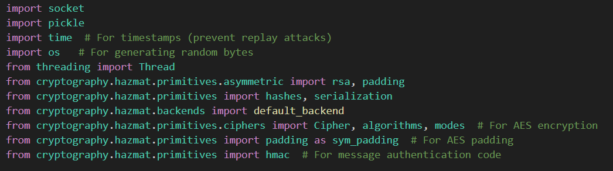

# Secure Client-Server Chat Application

**CPE 3151 - Information Engineering / Cryptography Project**

**Members:** Kent Vincent S. Godinez, Cedric Vince M. Tan

---

## Project Overview

A secure real-time chat application implementing hybrid encryption (AES + RSA) with digital signatures, HMAC integrity checks, and timestamp-based replay attack prevention. Built using TCP sockets with full-duplex communication via multithreading.

### Development Timeline

- **12/8/2025**: Created bidirectional TCP socket connection with RSA encryption
- **12/12/2025**: Integrated cryptography library for better security practices
- **12/13/2025**: Implemented hybrid encryption (AES + RSA), timestamps, HMAC, and helper functions

## Imports

## Helper Functions

### Encrypt Mssage
'''
def encrypt_message(message, recipient_public_key, sender_private_key):
    '''
    hybrid encryption:
    1. timestaps to prevent replay attacks
    2. random AES session key generation for fast symmetric encryption (256b = 32B) (encryption)
    3. message encryption with AES
    4. AES key encryption with RSA (secure key exchange)
    5. sign the original message with RSA (authentication)
    6. generate HMAC (integrity)
    '''

    # 1
    timestamp = str(int(time.time())) #current time in seconds
    timestamped_message = f"{timestamp}|{message}"

    # 2
    session_key = os.urandom(32)
    iv = os.urandom(16) #initialization vector (random starting point for AES)

    # 3
    cipher = Cipher(algorithms.AES(session_key), modes.CBC(iv))
    encryptor = cipher.encryptor()
    # since AES requires message length to be multiple of 16 bytes, we need to add the padding 
    padder = sym_padding.PKCS7(128).padder()
    padded_msg = padder.update(timestamped_message.encode()) + padder.finalize()
    # encryption with the padding
    ciphertext = encryptor.update(padded_msg) + encryptor.finalize()

    # 4
    encrypted_session_key = recipient_public_key.encrypt(
        session_key,
        padding.OAEP(
            mgf=padding.MGF1(algorithm=hashes.SHA256()),
            algorithm= hashes.SHA256(),
            label=None
        )
    )

    # 5
    signature = sender_private_key.sign(
        message.encode(),
        padding.PSS(
            mgf=padding.MGF1(hashes.SHA256()),
            salt_length=padding.PSS.MAX_LENGTH
        ), 
        hashes.SHA256()
    )

    # 6 
    h = hmac.HMAC(SHARED_SECRET, hashes.SHA256())
    h.update(ciphertext) #HMAC of encrypted data
    hmac_tag = h.finalize()

    return{
        'encrypted_session_key': encrypted_session_key,
        'iv': iv,
        'ciphertext': ciphertext,
        'signature': signature,
        'hmac': hmac_tag
    }
'''
### Decrypt Message
'''
def decrypt_message(package, recipient_private_key, sender_public_key):
    '''
    hybrid decryption:
    1. verify HMAC - fast integrity check (if ever it was tampered)
    2. decrypt AES session key using the RSA provate key
    3. decrypt message with AES session key
    4. remove padding
    5. verify timestamp
    6. verification of digital signature (who sent the message)
    '''

    encrypted_session_key = package['encrypted_session_key']
    iv = package['iv']
    ciphertext = package['ciphertext']
    signature = package['signature']
    received_hmac = package['hmac']

    # 1
    h = hmac.HMAC(SHARED_SECRET, hashes.SHA256())
    h.update(ciphertext)
    try:
        h.verify(received_hmac)
        hmac_status = "HMAC VERIFIED"
    except:
        return None, "HMAC VERIFICATION FAILED, DATA TAMPERED!"
    
    # 2
    session_key = recipient_private_key.decrypt(
        encrypted_session_key,
        padding.OAEP(
            mgf = padding.MGF1(algorithm=hashes.SHA256()),
            algorithm=hashes.SHA256(),
            label=None
        )
    )

    # 3
    cipher = Cipher(algorithms.AES(session_key), modes.CBC(iv))
    decryptor = cipher.decryptor()
    padded_message = decryptor.update(ciphertext ) + decryptor.finalize()

    # 4
    unpadder = sym_padding.PKCS7(128).unpadder()
    timestamped_message = unpadder.update(padded_message) + unpadder.finalize()
    timestamped_message = timestamped_message.decode()

    # 5
    try:
        timestamp_str, message = timestamped_message.split('|', 1)
        message_time = int(timestamp_str)
        current_time = int(time.time())
        age_seconds = current_time - message_time

        if age_seconds > 60: # if the message is older than 60 seconds
            return None, f"Message too old ({age_seconds}s old) - possibly a replay attack"
        
        timestamp_status = f"Message verified({age_seconds}s old)"
    except:
        return None, "Invalid timestamp format"
    
    # 6
    try: 
        sender_public_key.verify(
            signature,
            message.encode(),
            padding.PSS(
                mgf = padding.MGF1(hashes.SHA256()),
                salt_length=padding.PSS.MAX_LENGTH
            ),
            hashes.SHA256()
        )
        signature_status = "Signature verified!"
    except:
        signature_status = "Signature verification failed."

    # conbination of all security results
    security_status = f"{hmac_status} | {timestamp_status} | {signature_status}"

    return message, security_status
'''

## Main Section

### Send Message
'''

'''